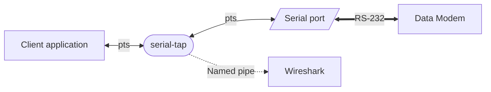

# Wireshark dissectors
A personal collection of Wireshark dissectors

## Prerequisites
The Unicast YAPP dissector requires the `zlib` module to decompress gzip payloads

## How to use
  - Clone this repository
  - Copy the lua files in your custom dissector path

Custom dissector path on *nix-like systems: `~/.local/lib/wireshark/plugins`

Custom dissector path on Windows: `%APPDATA%\Wireshark\plugins`

## About the dissectors

### FBB / B2F / WL2K
This dissector is currently composed of 4 distinct dissectors ( `fbb_tcp.lua`, `yapp_u.lua`, `lzhuf.lua`, `b2f_email.lua`)

Transport Layer support:
  - [ ] AX.25 Connected mode (needs stream tagging, proper I-frames reassembly, rejection handling and heuristic dissector support)
  - [X] ARDOP
  - [ ] VARA HF
  - [ ] VARA FM
  - [X] TCP/IP

Control protocol support:
  - [ ] MBL/RLI (needs documentation)
  - [X] ASCII Forward
  - [X] Basic Compressed forward v0
  - [X] Basic Compressed forward v1 (needs pcap traces for validation)
  - [X] B2F (Missing `;SQ:` and `;SR:` parsing)
  - [ ] Reverse handshake support

Payload decompression:
  - [ ] LZHUF (BCF v0, needs traces for validation)
  - [X] LZHUF (BCF v1 and B2F)
  - [X] GZIP (need to generate some captures)

User Payload parsing:
  - [ ] ASCII Basic Emails (need some traces for validation)
  - [ ] BCFv1 Emails (needs some pcap traces for validation)
  - [X] B2F Emails

### KISS over TCP
  - [X] Commands parsing
  - [X] Payload escape character processing
  - [ ] Frame reassembly / proper segmentation

### AGWPE
TBD

#### UI Frames
  - [X] APRS frame decoder (only targets UI frames)

#### Connected mode
  - [ ] Stream ID generation
  - [ ] v2.0 session tracking ( including handling rejects)
  - [ ] v2.2 session tracking ( including handling selective rejects)

### Serial Interceptor
TBD, the rough architecture would consist into a serial tap that links both a client application and a physical serial port.
The main challenge lies into handling the special signals (BRK, special lines, etc).
Downside is you need to explicitly specify the kind of device you're tapping on.

